# Automatic zone placement service

## Overview

In Kubernetes, it is not possible to schedule Pods for optimal network performance when Pods use resources outside of the cluster.

This project offers a solution by making Kubernetes-aware of network topology outside the cluster. A lightweight **lookup service** provides an endpoint to resolve an external resource's domain name to an IP address and maps it to a known network zone (like an AWS Availability Zone). This data is used with a mutating webhook to inject node affinity rules into Pods at creation time. This ensures Pods are scheduled in the same zone as the external resources they depend on, optimizing for low-latency communication. The mechanism is generic and works for any external resource, on-prem or in the cloud, as long as its FQDN resolves to a single IP in a known subnet.

The service includes built-in Prometheus metrics for monitoring DNS lookups, cache performance, and zone placement operations, making it easy to observe and optimize the system's behavior.

This approach can yield significant performance improvements; a simple `pgbench` benchmark demonstrates a ~175% to ~375% improvement in [TPS](https://en.wikipedia.org/wiki/Transactions_per_second). Any workload that is latency-sensitive can benefit from this.

_Note: This is not a fix for placing related workloads running in the same cluster relatively near each other. That is a problem already solved in Kubernetes with affinity rules and smart use of label selectors._

## The Problem

The basic problem is that the scheduler in Kubernetes is unaware of the network topology it is running on, so node assignment stays random. For instance, assume your RDS Writer Instance is running in AZ C, Kubernetes is not able to determine that it should (ideally) schedule your SQL client Pod in AZ C:

```mermaid
---
config:
  layout: fixed
---
flowchart TD
 subgraph subGraph0["Kubernetes Control Plane"]
        K8sAPI["K8s API Server"]
  end
 subgraph subGraph1["Availability Zone a"]
        Pod["SQL Client Pod
        I should be in zone C 🙁"]
        NodeA["K8s Node"]
  end
 subgraph subGraph2["Availability Zone b"]
        NodeB["K8s Node"]
  end
 subgraph subGraph3["Availability Zone c"]
        RDS[("RDS Writer Instance")]
        NodeC["K8s Node"]
  end
 subgraph subGraph4["AWS Region (eu-central-1)"]
        subGraph1
        subGraph2
        subGraph3
  end
    K8sAPI -- schedules pod by random (unaware of RDS location) --> Pod
    Pod -- "High Latency / Cross-AZ Traffic" --> RDS
    style K8sAPI fill:#D92A2A,stroke:#333,stroke-width:2px,color:#fff
    style Pod fill:#FF9900,stroke:#333,stroke-width:2px,color:#fff
    style RDS fill:#5A30B5,stroke:#333,stroke-width:2px,color:#fff
```



## Solution Architecture

By making network topology information available for the scheduler, we can allow it to make informed decisions. The best case for our workload is to be placed in the same AZ as the RDS instance it is communicating with:

```mermaid
graph TD
    subgraph "Kubernetes Control Plane"
        K8sAPI["K8s API Server"]
    end

    subgraph "AWS Region (eu-central-1)"
        subgraph "Solution Components"
            Kyverno["Kyverno Policy
            (Mutating Webhook)"]
            Lookup["Lookup Service"]
            Kyverno -- "gets location data" --> Lookup
        end

        subgraph "Availability Zone a"
            NodeA["K8s Node"]
        end
        subgraph "Availability Zone b"
            NodeB["K8s Node"]
        end
        subgraph "Availability Zone c"
            Pod["SQL Client Pod
            Minimal latency 😀"]
            RDS[("RDS Instance")]
            NodeC["K8s Node"]
        end
    end

    K8sAPI -- "admission controller,
    triggers webhook on Pod creation" --> Kyverno
    Lookup -. "perform informed / optimal placement of Pod" .-> Pod
    Pod -- "Low Latency" --> RDS

    style Pod fill:#FF9900,stroke:#333,stroke-width:2px,color:#fff
    style RDS fill:#5A30B5,stroke:#333,stroke-width:2px,color:#fff
    style Kyverno fill:#2771e2,stroke:#333,stroke-width:2px,color:#fff
    style Lookup fill:#2771e2,stroke:#333,stroke-width:2px,color:#fff
    style K8sAPI fill:#D92A2A,stroke:#333,stroke-width:2px,color:#fff
```



The solution has two main components:

1.  **A Lookup Service:** An API endpoint that can determine which zone a particular resource is located in. This endpoint accepts a domain name, resolves it to an IP, and maps that IP to a specific availability zone based on a predefined list of network CIDR ranges.
2.  **A Mutating Webhook:** Using a policy engine like Kyverno, a webhook intercepts Pod creation requests. If a Pod is annotated correctly, the webhook calls the lookup service to find the optimal zone and injects a `nodeAffinity` rule into the Pod's specification before it's scheduled.

Manually setting a Node Affinity rule is a temporary fix, but it fails when the external resource's location changes. For example, in a multi-node RDS cluster, the writer instance can be relocated during maintenance events, making static affinity rules unreliable.

## Implementation Guide

For this to work, you need the following present in your Kubernetes environment:

- Kyverno (or OPA, or create your own mutating policies to work in a similar fashion)
- A workload in Kubernetes that communicates with an external resource via FQDN
- The FQDN needs to return a _single_ A record for the external resource
- Zone information about your subnets

### Step 1: Gather Zone Information

To gather zone information, use this command to get the subnet data for your AWS environment:

```sh
$ aws ec2 describe-subnets --query 'Subnets[*].{CIDRBlock:CidrBlock, AvailabilityZone:AvailabilityZone, AvailabilityZoneId:AvailabilityZoneId}' --output json
[
  {"CIDRBlock":"10.0.192.0/20","AvailabilityZone":"eu-central-1b","AvailabilityZoneId":"euc1-az3"},
  {"CIDRBlock":"192.168.0.0/19","AvailabilityZone":"eu-central-1b","AvailabilityZoneId":"euc1-az3"},
  {"CIDRBlock":"192.168.128.0/19","AvailabilityZone":"eu-central-1a","AvailabilityZoneId":"euc1-az2"},
  {"CIDRBlock":"192.168.160.0/19","AvailabilityZone":"eu-central-1c","AvailabilityZoneId":"euc1-az1"},
  {"CIDRBlock":"192.168.32.0/19","AvailabilityZone":"eu-central-1a","AvailabilityZoneId":"euc1-az2"},
  {"CIDRBlock":"192.168.64.0/19","AvailabilityZone":"eu-central-1c","AvailabilityZoneId":"euc1-az1"},
  {"CIDRBlock":"192.168.96.0/19","AvailabilityZone":"eu-central-1b","AvailabilityZoneId":"euc1-az3"}
]
```

_**Note:** Having multiple AWS Accounts, VPC peerings or Transit Gateways? Map them as well. This will enable you to optimize Pod placement for even more external resources._

### Step 2: Deploy the Lookup Service with Helm

The recommended way to deploy the lookup service is using the provided Helm chart. First, update the `helm/values.yaml` file with your subnet information in the `subnets` field:

```yaml
subnets: |
  [
    {"CIDRBlock":"192.168.0.0/19","AvailabilityZone":"eu-central-1b","AvailabilityZoneId":"euc1-az3"},
    {"CIDRBlock":"192.168.32.0/19","AvailabilityZone":"eu-central-1a","AvailabilityZoneId":"euc1-az2"},
    {"CIDRBlock":"192.168.64.0/19","AvailabilityZone":"eu-central-1c","AvailabilityZoneId":"euc1-az1"}
  ]
```

Then deploy using Helm:

```sh
$ helm install automatic-zone-placement ./helm -n kyverno --create-namespace
NAME: automatic-zone-placement
LAST DEPLOYED: [timestamp]
NAMESPACE: kyverno
STATUS: deployed
REVISION: 1
```

The Helm chart will deploy:
- A Deployment running the lookup service (containerized Python application)
- A ConfigMap containing your subnet configuration
- A Service called `automatic-zone-placement` which Kyverno can utilize
- A Kyverno ClusterPolicy (enabled by default)
- Optional HPA, PodDisruptionBudget, and other production-ready configurations
- Optional ServiceMonitor for Prometheus Operator integration

#### Monitoring with Prometheus

The lookup service exposes Prometheus metrics at `/metrics`. To enable automatic scraping with Prometheus Operator, set `serviceMonitor.enabled: true` in your `values.yaml`:

```yaml
serviceMonitor:
  enabled: true
  interval: 30s
  scrapeTimeout: 10s
  additionalLabels:
    release: prometheus  # Adjust to match your Prometheus instance label
```

The service tracks metrics including:
- `http_requests_total` - Total HTTP requests by method, path, and status
- `dns_lookups_total` - Total DNS lookups performed
- `dns_cache_hits_total` / `dns_cache_misses_total` - Cache hit/miss rates
- `zone_lookups_success_total` / `zone_lookups_failure_total` - Zone lookup results
- `dns_cache_size` - Current number of cached DNS entries

#### DNS Cache Configuration

The service includes an intelligent DNS cache to reduce lookup latency and external DNS queries. Configure it via environment variables:

```yaml
environment:
  DNS_CACHE_TTL: 300        # Cache TTL in seconds (default: 5 minutes)
  DNS_CACHE_MAXSIZE: 1000   # Maximum cache entries (default: 1000)
  LOG_LEVEL: INFO           # Log level: DEBUG, INFO, WARNING, ERROR, CRITICAL
```


### Step 3: Verify the Deployment

Check that the lookup service is running:

```sh
$ kubectl get pods -n kyverno -l app.kubernetes.io/name=automatic-zone-placement
NAME                                        READY   STATUS    RESTARTS   AGE
automatic-zone-placement-7d4f8b5c9d-abcde   1/1     Running   0          1m
automatic-zone-placement-7d4f8b5c9d-fghij   1/1     Running   0          1m
```

Test the service endpoint:

```sh
$ kubectl run -it --rm debug --image=curlimages/curl --restart=Never -n kyverno -- \
  curl http://automatic-zone-placement/192.168.0.1.nip.io
{"zone":"eu-central-1b","zoneId":"euc1-az3"}
```

### Step 4: Test the Solution

Deploy a pod with the required annotation to see the mutation in action:

```sh
$ echo '---
apiVersion: v1
kind: Pod
metadata:
  name: pgbench-with-annotation
  annotations:
    automatic-zone-placement: my-rds-instance.cluster-c7eeqk68ktn1.eu-central-1.rds.amazonaws.com
spec:
  containers:
  - name: postgres
    image: postgres:15-bullseye
    command:
    - "/bin/bash"
    - "-c"
    - |
      echo "SELECT 1;" > /tmp/sql
      export PGPASSWORD=postgresqlpassword
      while true; do
        pgbench -h my-rds-instance.cluster-c7eeqk68ktn1.eu-central-1.rds.amazonaws.com -U postgresql -r -f /tmp/sql -T 9 -n postgres 2>&1 | grep -e tps -e latency
      done' | kubectl apply -f -
pod/pgbench-with-annotation created
```

We know this Pod should ideally be placed in zone `eu-central-1b`. Let's verify that a `nodeAffinity` was injected and the correct value was set:

```sh
$ kubectl get pod pgbench-with-annotation -o json | jq '.spec.affinity'
{
  "nodeAffinity": {
    "preferredDuringSchedulingIgnoredDuringExecution": [
      {
        "preference": {
          "matchExpressions": [
            {
              "key": "topology.kubernetes.io/zone",
              "operator": "In",
              "values": [
                "eu-central-1b"
              ]
            }
          ]
        },
        "weight": 100
      }
    ]
  }
}
```

It worked! We see that the `nodeAffinity` field was added by the Kyverno policy.

## Performance Impact

Running `pgbench` with a simple `SELECT 1;` query in a loop, it is easy to spot the performance difference. Below is an output from a Deployment with 3 replicas, one Pod per zone, _without_ the automatic placement annotation. Can you spot which Pod is running in the same AZ as its RDS instance?

```
pgbench-6544568f8b-72kx5 latency average = 0.147 ms
pgbench-6544568f8b-72kx5 tps = 6793.317768 (without initial connection time)
pgbench-6544568f8b-7h4dk latency average = 0.704 ms
pgbench-6544568f8b-7h4dk tps = 1420.275917 (without initial connection time)
pgbench-6544568f8b-25vsx latency average = 0.404 ms
pgbench-6544568f8b-25vsx tps = 2473.397971 (without initial connection time)
```

That's a 175% to 375% performance improvement. For anyone working with networking, this isn't a surprise. Lower latency means improved performance.

AWS publish intra-zone latency metrics for each zone in all regions via their [Network Manager > Infrastructure Performance](https://eu-central-1.console.aws.amazon.com/nip/) page. At the time of writing, the following latency metrics was:

```
Cross-AZ latency:
euc1-az1 to euc1-az2: 0.656 ms
euc1-az2 to euc1-az3: 0.548 ms
euc1-az3 to euc1-az1: 0.458 ms

Inter-AZ latency:
euc1-az1 to euc1-az1 0.104 ms
euc1-az2 to euc1-az2 0.119 ms
euc1-az3 to euc1-az3 0.107 ms
```

The above data shows that within the same region, one should expect a latency of ~0.100 ms. But, if your application has to traverse to another zone in the same region, the latency increases to ~0.450-0.650 ms. This increase in cross-AZ latency matches roughly the performance gains shown previously.

So the math checks out :)

## Local testing

The Python script has example CIDR ranges and can be run locally for testing.

```sh
$ python3 ./src/server.py &
[...]
$ curl localhost:8080/192.168.0.1.nip.io | jq
{
  "zone": "eu-central-1b",
  "zoneId": "euc1-az3"
}
$ curl localhost:8080/192.168.32.1.nip.io | jq
{
  "zone": "eu-central-1a",
  "zoneId": "euc1-az2"
}
```

### Additional Endpoints

The service provides several endpoints for health checks and monitoring:

```sh
# Health check endpoints
$ curl localhost:8080/healthz
{"status":"ok"}

$ curl localhost:8080/readyz
{"status":"ok"}

# DNS cache statistics
$ curl localhost:8080/cache/stats | jq
{
  "total_entries": 5,
  "entries": ["google.com", "amazon.com"],
  "maxsize": 1000,
  "ttl": 300
}

# Prometheus metrics
$ curl localhost:8080/metrics
# HELP http_requests_total Total number of HTTP requests
# TYPE http_requests_total counter
http_requests_total{method="GET",path="/healthz",status="200"} 42.0
...
```

### Docker Compose Testing

You can also test the service with Docker Compose, which includes a load generator for realistic testing:

```sh
$ docker-compose up
```

This will start:
- The lookup service on port 8080
- A load generator that continuously queries various domains

Watch the metrics endpoint to see the DNS cache and zone lookups in action.

_Note: Beware that your local DNS resolver might implement DNS rebinding protection, which may result in failure to resolve local and private IP addresses. Using nip.io won't work in that case._

# Summary

This solution shows how one can increase performance by ~175%-375%, by adding additional meta-data for the kube-scheduler to use to make informative Pod placement. OK, thats not really correct, but it sounds better. What this solution really does is ensuring _consistent_ and _best_ performance by placing the Pods in the correct availbility zone.

I think this approach can be very valuable for those who require low latency or want to reduce cross-AZ data transfer cost. I wouldn't be surprised if this approach could be used for on-prem as well, as long as there is sufficient meta-data available.

Got a physical database in Rack A, Row 2 in DC 1? _Most likely_ the network performance is best at the rack level, so you could have a lookup policy that would return that the Pod placement should be in Rack A if possible, then Row 2 and definitly in DC 1.

This could be used with strechted Kubernetes clusters with AWS Outpost as well. Of course I would like my developers to care more about the placement of the resources they connect to, but few do.

I'm working on a solution when the external service is multi-AZ capable, then placement of the Pod is not important, but traffic routing is. Stay tuned.

## FAQ

<details>
<summary>What was the motivation for this project?</summary>

I was working on a platform team that got a rather special support request: "Our application is _slower_ in production, help?". It turned out that their production workload was (by chance) deployed in another zone than their RDS instance. Apparently, cross-AZ latency is actually relatively large compared to same-zone latency. Hence this solution.

</details>

<details>
<summary>Why not just use static node affinity rules?</summary>

While node affinity rules could solve this problem manually, they lack the ability to automatically adapt when external resources move. For example, RDS instances "frequently" move between availability zones during maintenance events, patching, or instance resizing, which would require constant manual updates to affinity rules.

</details>

<details>
<summary>Why do you include both `zone` and `zoneId`?</summary>

Because your `eu-central-1a` is probably different from my `eu-central-1a`. AWS maps physical Availability Zones randomly to the AZ names for each AWS account. The Availability Zone ID (`zoneId`) is the same for everyone. See the [AWS documentation](https://docs.aws.amazon.com/ram/latest/userguide/working-with-az-ids.html) for more details.

</details>

<details>
<summary>Does this work in GCP or Azure?</summary>

Kinda. In AWS, subnets are zonal resources, making it easy to map an IP to a zone. In GCP and Azure, subnets are regional resources. This means you would have to query the cloud provider API to determine which zone an IP address is currently located in, which adds significant complexity (permissions, rate limiting, etc.).

</details>

<details>
<summary>Have you considered alternative solutions?</summary>

Yes:

- **Modifying manifests in the CI/CD pipeline:** Adds complexity and requires re-triggering pipelines when the resource location changes.
- **A sidecar container:** Adds complexity, and the Pod would need permissions to query the cloud API.
- **A custom controller:** Same issues with permissions and complexity.
- **Setting affinity on the Deployment/StatefulSet:** Could work with a background job in Kyverno. The environment is mainly spot instances, so Pods are already frequently re-scheduled. Also determined that we would like to avoid any sync issues with ArgoCD, just to keep it simple.

</details>

## Future Work

- **Support for multiple A-records:** The current solution does not work for endpoints that return multiple A records (e.g., an AWS Application Load Balancer). I'm working on a solution for this, so if your interested let me know.
